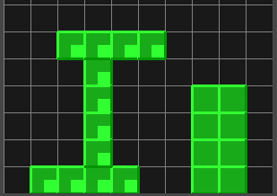
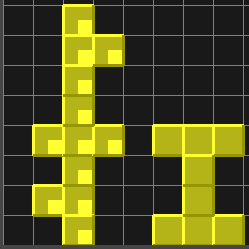
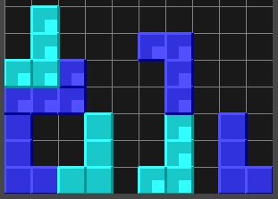

# City Tetris

## Rules

City Tetris looks similar to Tetris on the surface, but there are two major differences. First of all, blocks never disappear, even if you have a full row. Second, you get points for building specific structures in your city.

### Scoring

#### Full rows

In normal tetris, full rows disappear and give points. In City Tetris, blocks never disappear. Still, you get points for each full row. The multiplier is 3, so if you have 5 full rows, you get 15 points.

#### I blocks

I blocks give points for the greatest distance covered. The blocks must touch eachother (diagonal does not count). Then count the greatest horizontal and vertical distance covered by the blocks. If you have multiple I blocks, only the longest one counts.



In this example, the touching I blocks on the left cover the longest distance, so only they count. The distance covered is 9 because you can take 4 vertical steps and 5 horizontal steps.

The multiplier for I blocks is 1, so this would result in 9 total points.

#### T blocks

T blocks give points for the biggest cluster. The blocks must touch eachother (diagonal does not count). Then count the number of T blocks in the biggest cluster. If there are multiple clusters, only the biggest one counts.



In this example, the left cluster consists of 3 T blocks and the right one of 2, so only the left one counts. The multiplier is 6, so this cluster gives 18 points.

#### L and J blocks

L and J blocks give points for each distinct cluster that contains at least one L and at least one J block. For blocks to form a cluster, they must touch (diagonal does not count). Having more than one L or J block in a cluster does not give additional points.



In this example, there are three clusters. The cluster on the far right only has an L block but no J block, therefore it doesn't count. The cluster on the left has 2 L and 2 J blocks, but it still only counts as one cluster. Together with the cluster in the middle, that is 2 L-J clusters. The multiplier is 4, so that makes 10 points.

#### Other blocks

As of now, other blocks don't provide any points.

### Controls

Choose menu items with the mouse. From the main menu, press ESC or click on [x] to leave the game.

Move the blocks left and right using the LEFT and RIGHT arrow. Hold down the DOWN arrow to make them fall faster. Press SPACE to rotate the block.

### Menu

#### Start

Press start to start a new game.

#### Random Seed

When leaving the random seed box empty, you will get a completely random sequence of blocks.

Enter a random seed -- up to 6 numbers or characters -- to get a specific random sequence. If you want to try the same random sequence again, just use the same seed. Or share it with your friends to find out who can get the higher score using the same blocks.

#### Highscore

Show the top 10 scores.

## Installation

### From source

It is recommended to create a [virtual environment](https://docs.python.org/3/tutorial/venv.html) in Python. The game was tested with Python 3.10 but it might also work with other Python versions. After creating and activating the virtual environment, install the dependencies:

```
python -m pip install requirements.txt
```

To start the game, run:

```
python citytetris/main.py
```

## Development

Install the normal dependencies. Additionally, install the dev dependencies:

```
python -m pip install -r requirements.txt
```

### Running tests

From the root directory, run:

```
pytest
```

### Running the type checker


From the root directory, run:

```
mypy citytetris
```

### Running the code formatter

From the root directory, run:

```
black citytetris
```

### Building exe

Untested: From the root directory, run:

```
python -m nuitka --follow-imports --standalone citytetris/main.py
```
